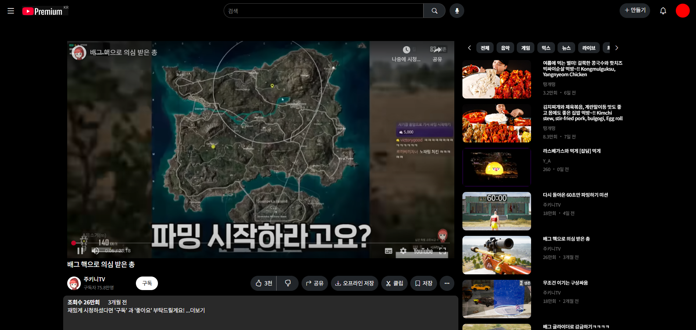
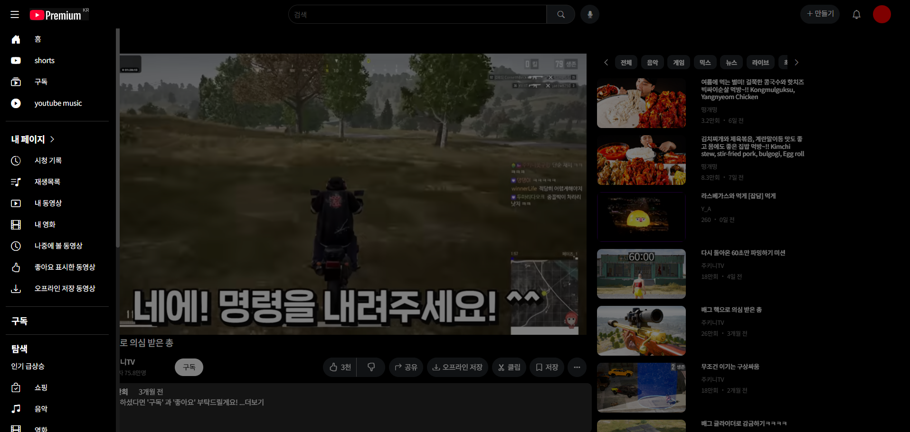

# Youtube Copy Project
## 🔍 프로젝트 소개

개요: Html, CSS, JavaScript를 사용해 상용화된 웹 페이지 구성을 구현하여 배운 것을 복습하고, 개발자 입장에서 느끼는 사용자 친화적인 화면 구성에 대해 생각해 볼 수 있는 프로젝트

배포 링크:  https://autopopcornshooter.github.io/EST_Project1/index.html

## 🗂️ 폴더 구조
```
Root
│  index.html
│  indexLayout.html
│  playScreenLayout.html
│  README.md
│  subscribeLayout.html
│  video.html
│
├─css
│      youtube_home_elementDesign.css
│      youtube_home_layoutDesign.css
│
├─data
│      contentsData.json
│
├─element
│      comment.html
│      content-card.html
│      list-card.html
│      navbar.html
│      offcanvasSidebar.html
│      secondNavbar.html
│      sidebar.html
│
└─script
        eventHandler.js
        main.js
        pageLayout.js
        video.js
```
* 재사용율이 높거나 객체화해야 할 HTML요소들 요소의 속성별로 분류
    + ex) navbar.html과  content-card.html은 페이지 전환 시 마다 로드되며, content-card는 데이터 컨테이너 기능 또한 수행(반복 생성 가능-> 파일 분리{객체화})
    + 같은 템플릿을 가지고 여러개 생성될 여지가 있는 content-card는 element, 화면을 구성하면 여러 번 생성되지 않는 navbar는 layout폴더로 분류

## ⚙️ 구현된 기능
## 1단계

- 상단 네비게이션 바 로고 클릭 시 페이지 리로드
- 사용자 아이콘 클릭 시 계정 정보 확인가능
- ++ 컨텐츠 제작 버튼과 알림 버튼 드롭다운 구현
## 2단계

- 좌측 사이드바 홈, 구독 버튼 클릭 시 해당 페이지로 이동
- 영상 컨텐츠 카드 화면에 3열 구성
- 컨텐츠 마우스 hover 시 카드 확대 효과 부여
## 3단계


- 컨텐츠 카드 클릭 시 이동하는 URL에 videoID를 전달하여 페이지 리로드해도 같은 영상을 확인할 수 있음
- contentsData.Json 의 영상 ID를 확인하여 해당 영상 및 채널 정보 조회수, 업로드 날짜 등의 데이터 입력
- 영상 재생 페이지의 사이드바는 offCanvas 형태로 구현
    + sidebar이외의 화면이나 햄버거버튼 클릭 시 창 닫힘
- 댓글 입력 후 submit 시 하단 댓글창에 댓글 표시(창 나가면 사라짐)
    + 입력창 비워놓고 submit 시 경고창 출력
- 우측 컨텐츠 카드 리스트 구현

## 🧱 기술 스택

### 💻 개발 환경
- **언어**: HTML, CSS, JavaScript
- **IDE**: VS Code

### 🧰 라이브러리 & 패키지
- BootStrap

### 📦 배포 & 버전 관리
- Git / GitHub
- GitHub Pages (Web Build)

## 🤒 문제 상황 및 해결
### Row 사용 시 레이아웃 너비 조절 불가
- row class 특성으로 자동으로 width를 설정함 => row 제거하고 d-flex 사용하여 대체
### 비동기 실행으로 인해 Json파일 로드 할 때 데이터 꼬임 발생(간헐적)
- html 요소를 먼저 로드 후 json에서 데이터를 받아와 요소에 입력하는 방법 사용
    + 직관적이고 객체지향적이지만 요소 로드와 데이터 로드 시간차로 인해 데이터 꼬임 발생 가능
- json 데이터를 먼저 가져온 뒤 직접 텍스트로 작성한 html 요소에 입력
    + 데이터가 입력된 개체를 직접 반환하여 데이터 꼬임 발생 없지만 코드가 복잡해지고 '비 객체지향적'

=> 첫번째 방법을 사용하되, 데이터 입력을 .then() 내부에서 수행하여 데이터 꼬임 예방
### 배포 시 경로 이슈
- VsCode 라이브 디버그 할 땐 정상동작했던 경로들이 Github 배포 URL 접속시 동작하지 않는 문제 발경
- 파일 로드 시 지정하는 경로를 '상대 경로'에서 '절대 경로'로 변환하여 해결