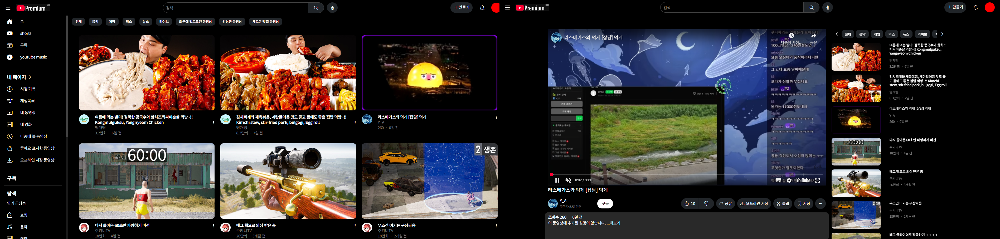
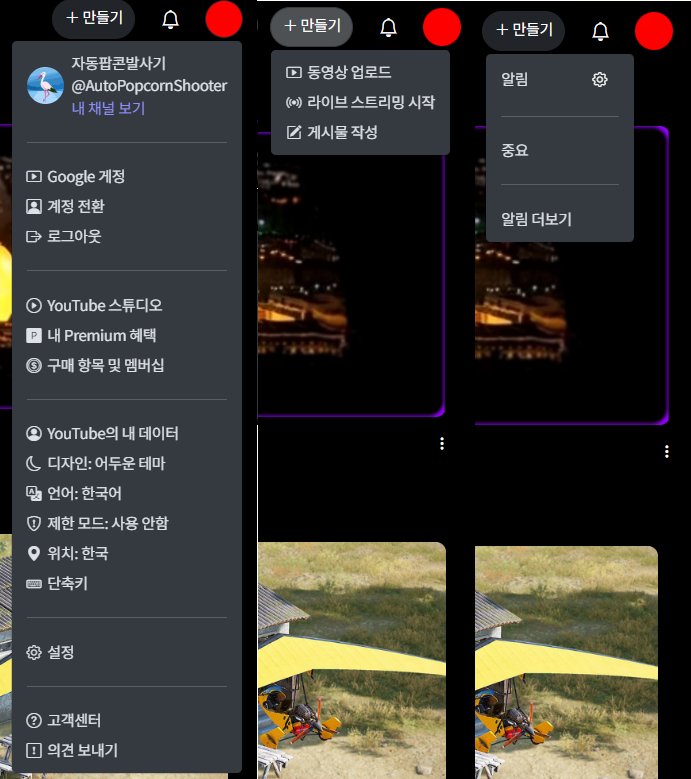
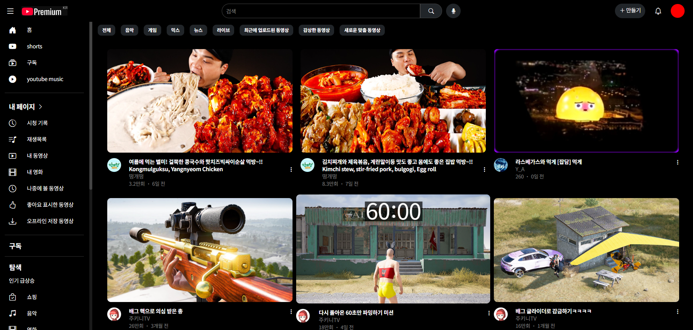

# Youtube Copy Project
## 프로젝트 소개

개요: Html, CSS, JavaScript를 사용해 상용화된 웹 페이지 구성을 구현하여 배운 것을 복습하고, 개발자 입장에서 느끼는 사용자 친화적인 화면 구성에 대해 생각해 볼 수 있는 프로젝트

배포 링크:  https://autopopcornshooter.github.io/EST_Project1/index.html

## 폴더 구조
```
Root
│  index.html
│  indexLayout.html
│  playScreenLayout.html
│  README.md
│  subscribeLayout.html
│  video.html
│
├─css
│      youtube_home_elementDesign.css
│      youtube_home_layoutDesign.css
│
├─data
│      contentsData.json
│
├─element
│      comment.html
│      content-card.html
│      list-card.html
│      navbar.html
│      offcanvasSidebar.html
│      secondNavbar.html
│      sidebar.html
│
└─script
        eventHandler.js
        main.js
        pageLayout.js
        video.js
```
* 재사용율이 높거나 객체화해야 할 HTML요소들 요소의 속성별로 분류
    + ex) navbar.html과  content-card.html은 페이지 전환 시 마다 로드되며, content-card는 데이터 컨테이너 기능 또한 수행(반복 생성 가능-> 파일 분리{객체화})
    + 같은 템플릿을 가지고 여러개 생성될 여지가 있는 content-card는 element, 화면을 구성하면 여러 번 생성되지 않는 navbar는 layout폴더로 분류

## 구현된 기능
## 1단계

- 상단 네비게이션 바 로고 클릭 시 페이지 리로드
- 사용자 아이콘 클릭 시 계정 정보 확인가능
- ++ 컨텐츠 제작 버튼과 알림 버튼 드롭다운 구현


- 좌측 사이드바 홈, 구독 버튼 클릭 시 해당 페이지로 이동
- 영상 컨텐츠 카드 화면에 3열 구성
- 컨텐츠 마우스 hover 시 카드 확대 효과 부여
